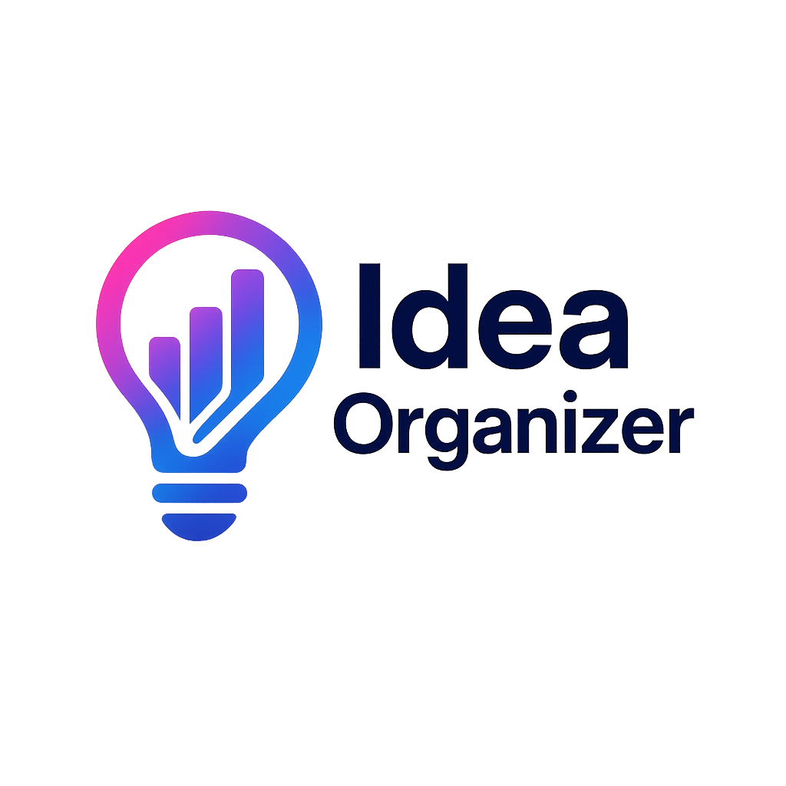

<p align="center">
  
</p>

# Organizador de Ideas

Una herramienta visual para organizar y estructurar ideas de manera automática usando la API de OpenAI. Es ideal para escribir, desglosar, estructurar proyectos, flujos o simplemente plasmar ideas rápidamente.

## Características

- Entrada flotante para escribir ideas, minimizable y movible.
- Visualización de ideas organizadas en tarjetas dinámicas.
- Auto-organización tipo Grid para aprovechar el espacio.
- Detección automática de respuestas en JSON.
- Copia protegida (requiere doble clic para seleccionar).
- Compatible con escritorio y dispositivos móviles (drag & drop adaptado).
- Barra de carga durante la organización.
- API Key configurable y guardada en localStorage.

## Estructura

```
organizador-de-ideas/
├── index.html         # Página principal
├── style.css          # Estilos visuales
├── script.js          # Lógica principal
├── assets/
│   └── logo.png           # Logo de la aplicación
│   └── minimized-icon.png   # Icono flotante
└── README.md         # Instrucciones
```

## Requisitos

- Una API Key de OpenAI (GPT-3.5, GPT-4-turbo o GPT-4o).

## Uso

1. Descarga los archivos.
2. Abre `index.html` en tu navegador.
3. Pega tu API Key de OpenAI en el campo superior y guárdala.
4. Escribe tus ideas en la burbuja flotante.
5. Presiona **Organizar (Ctrl + Enter)**.
6. Visualiza tus ideas estructuradas automáticamente en tarjetas.

## Personalización

Si quieres cambiar el modelo o los límites de tokens, edita el archivo `script.js` en la sección:

```js
model: 'gpt-4o',
max_tokens: 4096
```

## Soporte móvil

La burbuja flotante puede moverse también desde el móvil arrastrando con el dedo.

---

**Logo:**

El logo utilizado en este proyecto está disponible en la carpeta `assets/` bajo el nombre `logo.png` y puede ser modificado libremente según tus necesidades.